# CHALAMANDRA MAGISTRAL DECOX // v12.0 FLUX

**Arquitectura Cuántica Inversa | Sistema Modular Vivo | SRAP (Symmetry, Resilience, Adaptability, Performance)**

> "Donde el código baila y la lógica se deconstruye para crear."

Este repositorio contiene **Chalamandra Magistral DecoX**, un sistema full-stack diseñado bajo los principios de la arquitectura Chola Malandra: robusto, elegante y preparado para el caos. Cada módulo es un ente autónomo que contribuye a la sinfonía global.

## 🧬 Estructura Modular

El sistema está dividido en núcleos de procesamiento especializados:

*   **CHOLA** (`/src/modules/Chola`): El núcleo duro. Infraestructura base, terminales de comando y utilidades de bajo nivel.
*   **FRESA** (`/src/modules/Fresa`): La capa estética. Media Studio, generación de arte, interfaz visual pulida.
*   **MALANDRA** (`/src/modules/Malandra`): Inteligencia operativa. Análisis de matrices, despliegues, seguridad y hacking ético.
*   **BALLERINA** (`/src/modules/Ballerina`): Orquestación UI. Ventanas, iconos y elementos que danzan en la pantalla.
*   **BALLET** (`/src/modules/Ballet`): La composición final. El core que une todo (`App.tsx`, `index.tsx`).
*   **FOLKLÓRICO** (`/src/modules/Folklorico`): La voz del sistema. Conversación en vivo, logs, historia y tradición oral.

## 🧜‍♀️ Diagrama de Flujo (Mermaid)

```mermaid
graph TD
    User((Usuario)) --> |Interacts| B[Ballerina UI Layer]
    B --> |Orchestrates| C[Ballet Core]

    subgraph "Módulos Vivos"
        C --> |Commands| CH[Chola Terminal]
        C --> |Visuals| FR[Fresa Studio]
        C --> |Intelligence| MA[Malandra Ops]
        C --> |Voice| FO[Folklórico Comms]
    end

    MA --> |Analyzes| EXT[External APIs / Gemini]
    FR --> |Generates| EXT
    FO --> |Streams| EXT

    classDef chola fill:#000,stroke:#fff,stroke-width:2px;
    classDef fresa fill:#ff00ff,stroke:#fff,stroke-width:2px;
    classDef malandra fill:#FFD700,stroke:#000,stroke-width:2px;
    classDef ballerina fill:#00ffff,stroke:#000,stroke-width:2px;

    class CH chola;
    class FR fresa;
    class MA malandra;
    class B ballerina;
```



## 🚀 Instalación y Despliegue

### Requisitos
*   Node.js v18+
*   NPM o Yarn
*   Una clave de API de Google Gemini (para funciones de IA)

### Setup Local

1.  **Clonar el repositorio:**
    ```bash
    git clone <repo-url>
    cd system_decode_magis
    ```

2.  **Instalar dependencias:**
    ```bash
    npm install
    ```

3.  **Configurar Variables de Entorno:**
    Crea un archivo `.env` en la raíz (ver `.env.example` si existiera, o usa el template abajo):
    ```env
    GEMINI_API_KEY=tu_api_key_aqui
    ```

4.  **Iniciar Modo Desarrollo:**
    ```bash
    npm run dev
    ```

### Despliegue (Vercel/Netlify)

1.  Este proyecto está optimizado para **Vercel**.
2.  Importa el repositorio.
3.  Selecciona el preset **Vite**.
4.  Define la variable de entorno `GEMINI_API_KEY`.
5.  Deploy.

## 🛡️ Seguridad y Performance

*   **Sin secretos en repo:** `.gitignore` configurado estrictamente.
*   **Modularidad:** Carga de componentes bajo demanda (Lazy Loading recomendado para módulos Fresa y Malandra en futuras iteraciones).
*   **Optimización:** Build optimizado con Vite y separación de chunks para librerías pesadas como `@google/genai`.

## 🎨 UX/UI & Customización

El sistema utiliza **Tailwind CSS** con una configuración extendida para el tema "Cyberpunk/Neon".

*   **Fuentes:** Rajdhani (Estructural), Share Tech Mono (Código).
*   **Colores:** Neon Gold, Cyber Purple, Acid Green.

---

### 📝 TODO / Próximos Pasos

1.  [ ] Recibir inputs visuales del usuario (Logos, Paletas específicas).
2.  [ ] Implementar Lazy Loading en rutas.
3.  [ ] Añadir tests E2E para flujos críticos (Malandra -> Fresa).

---

*Desarrollado con pasión cuántica por Jules.*
